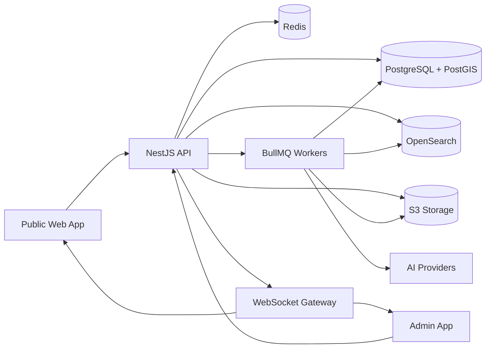

# Architecture

## Bounded Contexts

### Tenant Management

Owns agencies, workspaces, custom domains, branding, subscription limits, and tenant isolation.

### Identity And Access

Owns users, roles, permissions, agent teams, sessions, and API tokens.

### Property Inventory

Owns listings, units, buildings, developers, media, amenities, location, pricing, status, and availability.

### Search And Discovery

Owns structured search, natural-language search, saved searches, ranking, recommendations, and comparison.

### Investment Intelligence

Owns rent estimates, yield calculations, ownership costs, ROI assumptions, price history, and scenarios.

### Neighborhood Intelligence

Owns POIs, walkability, lifestyle scores, area profiles, map layers, and local knowledge.

### AI Operations

Owns AI provider routing, RAG, prompt templates, OCR, image analysis, translations, and generated content.

### Lead And CRM

Owns inquiries, leads, source attribution, agent assignment, pipeline stages, notes, and conversion analytics.

### Async Jobs

Owns import jobs, indexing jobs, AI generation jobs, image processing, retries, and progress updates.

## High-Level Flow



## Backend Module Shape

Each domain module should move toward this shape:

```txt
module/
  application/
    commands/
    queries/
    handlers/
  domain/
    aggregates/
    events/
    value-objects/
  infrastructure/
    persistence/
    search/
    jobs/
  presentation/
    rest/
    websocket/
```

## Event Examples

- `PropertyListed`
- `PropertyPriceChanged`
- `PropertyStatusChanged`
- `PropertyMediaUploaded`
- `PropertyIndexed`
- `AiListingSummaryGenerated`
- `LeadCreated`
- `ImportJobCompleted`

